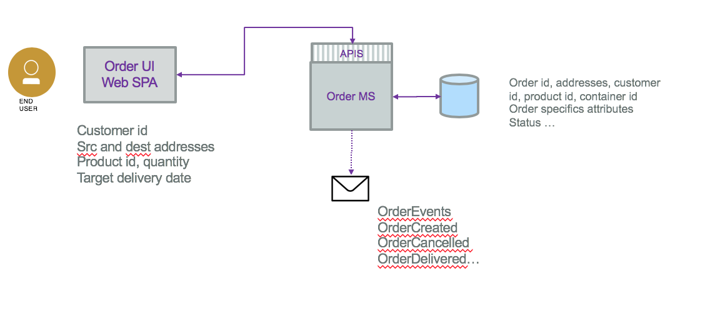
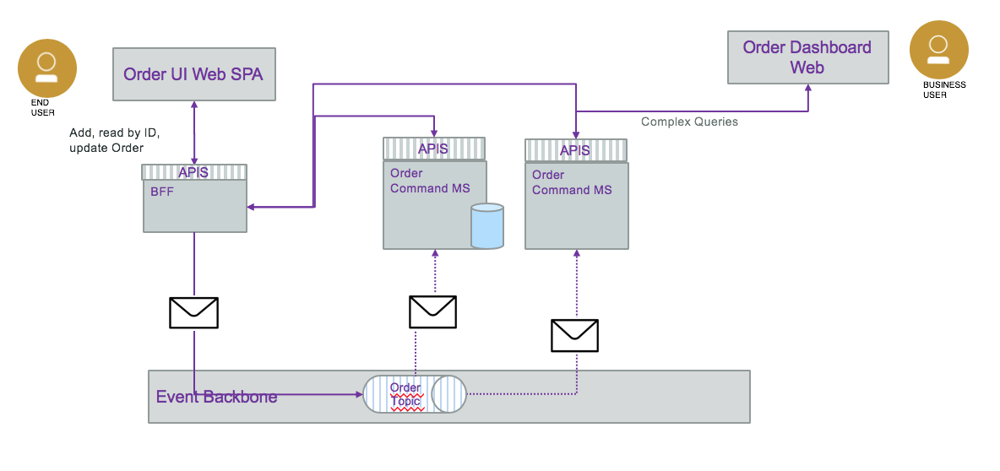

# K Container Shipment Order Management

This project is one reference implementation of the CQRS and event sourcing patterns as part of the [Event Driven Architecture](https://github.com/ibm-cloud-architecture/refarch-eda) reference architecture. From a use case point of view, it implements one of the [K Container shipment process](https://github.com/ibm-cloud-architecture/refarch-kc) microservices. This repository aims to support the order management for the order from the manufacturer to the shipment company. The business process is defined [here](https://github.com/ibm-cloud-architecture/refarch-kc/blob/master/analysis/readme.md).

The goals of the code implemented in this project is to illustrate the event sourcing and CQRS patterns. One of the business requirements for adopting these patterns is to be able to get visibility to the history of order and progress of the shipment. This would include the ability to determine: 

1. How frequently does an order get cancelled after it is placed but before an empty container is delivered or loaded ?
1. How often does an order get cancelled after the order is confirmed, a container assigned and goods loaded into it?
1. What are all events for a particular order and associated container shipment?  
1. Has the cold chain been protected on this particular order?

For the first question we need events like OrderPlaced(orderId), OrderCancelled(orderID) and in the read model the OrdersStatuses(orderId, status, timestamp); OrderStatusTransition(orderId, oldStatus, new Status timestamp) and then OrdersCancelledAfterPlaced(orderId, timestamp). We will detailed how to implement those functions in later section.

## User stories
The business requirements and Epics are defined in [this note](https://github.com/ibm-cloud-architecture/refarch-kc#orders-microservice-place-shipment-order---user-story)

The following user stories are done in this project:
- [ ] As a manufacturer manager I want to enter container shipment order information like product reference, quantity (one or more containers),  pickup from address, earliest pickup date, shipment to address,  shipment by date, and required temperature in transit range so the shipping company can give me back an order confirmation ( including the orderID), expected pickup and delivery dates, the assigned voyage and ship name
> As the microservice will not have a dedicated UI, we are using the demonstration UI to define forms to gather the data. So this user story is implemented in the kc-ui project, and in this microservice we need to offer the create and update operations and get by order ID
- [ ] As a manufacturer manager I want to read the status of an order given its order id and receive a report with the full event history of related order, voyage ship and container events. 
> The order id is generated by the order create operation, and is immutable. An order is assigned to a voyage at the time it is created.
- [ ] As a shipment company manager I want to update the status of an order, and add voyage, container and ship information once I know them, also possible modify pickup date and expected delivery date.
- [ ] As a shipment manager I want to be able to assign a shipment request from a customer to a specific voyage in order to create a confirmed order. The selected voyage must be from a source port near the pickup location travelling to a destination port near the delivery location requested by the customer.  It must be within the time window specified by the customer in the order request.  The selected voyage must have free space available ( capacity not previously assigned to other orders) to accomodate the number of containers specified by the customer in their shipment request.  
> Same as above the UI is in kc-ui, so here is a model and the update operation.

## Data and Event Model
By applying a domain-driven design we can identify aggregates, entities, value objects and domain events. Those elements help us to be our information model as classes. For any event-driven microservice you need to assess what data to carry in the event and what persist in the potential data source. 
The following diagram illustrates the different data models in the context of this order microservice:



The Order entered in the User interface is defined like:
```
 class Address {
    street: string;
    city: string;
    country: string;
    state: string;
    zipcode: string;
}

 class Order {
    orderID: string;
    customerID: string;
    pickupAddress: Address;
    destinationAddress: Address;
    productID: string;
    quantity: string;
    expectedDeliveryDate: string;   //  date as ISO format
}
```

The information to persist in the database may be used to do analytics, and get the last status of order. It may look use relational database and may have information like:

```
 class Address {
    street: string;
    city: string;
    country: string;
    state: string;
    zipcode: string;
}

 class Order {
    orderID: string;
    customerID: string;
    pickupAddress: Address;
    destinationAddress: Address;
    productID: string;
    quantity: string;
    expectedDeliveryDate: string;   //  date as ISO format
    pickupDate: string;   //  date as ISO format
}

class OrderContainers {
    orderID: string;
    containerID: string[];
}
```
On the event side we may generate OrderCreated, OrderCancelled,... But what is in the event payload? We can propose the following structure where type will help to specify the event type and getting a generic payload we can have anything in it.
```
class OrderEvent {
    orderId: string;
    timestamp: string;   //  date as ISO format
    payload: any;
    type: string;
    version: string;
}
```

Also do we need to ensure consistency between those data views? Where is the source of truth? 

In traditional SOA service with application maintaining all the tables and beans to support all the business requirements, ACID transactions support the consistency and integrity of the data, and the database is one source of truth. With microservices responsible  To answer those questions we need to review the event-driven microservice patterns we will use and then we will address data consistency [here](#the-consistency-challenge).


If you want to read more about [Event Sourcing and CQRS patterns, read more there...](https://github.com/ibm-cloud-architecture/refarch-eda/blob/master/docs/evt-microservices/ED-patterns.md)

## How to build and run

Each microservice has a build script to perform the maven package and build the docker image. See `scripts` folder.

* For order-command-ms
 ```
 ./scripts/buildDocker.sh
 ```
 * For order-query-ms
 ```
 ./scripts/buildDocker.sh
 ```

To run the complete solution locally we use [docker compose](https://github.com/ibm-cloud-architecture/refarch-kc/blob/master/docker/kc-solution-compose.yml) in the root project.

## How we implemented it

As introduced in the [high level design note](https://github.com/ibm-cloud-architecture/refarch-kc/blob/master/docs/design.md) the order life cycle looks like in the following diagram:


The order microservice supports the implementations of this life cycle, using event sourcing and CQRS.

There are different possible design approaches to use event sourcing. The following diagram illustrates the CQRS and event sourcing as well as the Saga pattern as the order command service is persisting order in its own datasource before creating event. The query part is a consumer of event and build projections to support the different queries:


The BFF is using the API of the order services to get create or update orders and perform complex queries. 

Using this model helps to encapsulate the order mananagement in the boundary of a reusable service.

The alternate is to have the BFF pushing events to the event source and then having the order service consuming event to persist them.



As the BFF still needs to get order by ID or perform complex query it has to access the order service. The responsability is splitted and if CQRS is not a viable pattern in long term, the BFF code needs to be modified. It is also simpler for the BFF to do HTTP calls than posting to kafka topic.

The following sequence diagram illustrates the relationships between the components and one potential implementation of the Saga pattern.


See [the REST end point source code here](https://github.com/ibm-cloud-architecture/refarch-kc-order-ms/blob/6de424c443c05262ae013620f5f11b4a1b2e6f90/order-command-ms/src/main/java/ibm/labs/kc/order/command/service/OrderCRUDService.java#L51-L74)

and the [order events consumer](https://github.com/ibm-cloud-architecture/refarch-kc-order-ms/blob/6de424c443c05262ae013620f5f11b4a1b2e6f90/order-command-ms/src/main/java/ibm/labs/kc/order/command/service/OrderAdminService.java#L35) in the command pattern.


## Contribute

As this implementation solution is part of the Event Driven architeture reference architecture, the [contribution policies](./CONTRIBUTING.md) apply the same way here.

**Contributors:**
* [Jerome Boyer](https://www.linkedin.com/in/jeromeboyer/)
* [Edoardo Comar](https://www.linkedin.com/in/edoardo-comar/)
* [Jordan Tucker](https://www.linkedin.com/in/jordan-tucker-ba328a12b/)
* [Mickael Maison](https://www.linkedin.com/in/mickaelmaison/)
* [Francis Parr](https://www.linkedin.com/in/francis-parr-26041924)

